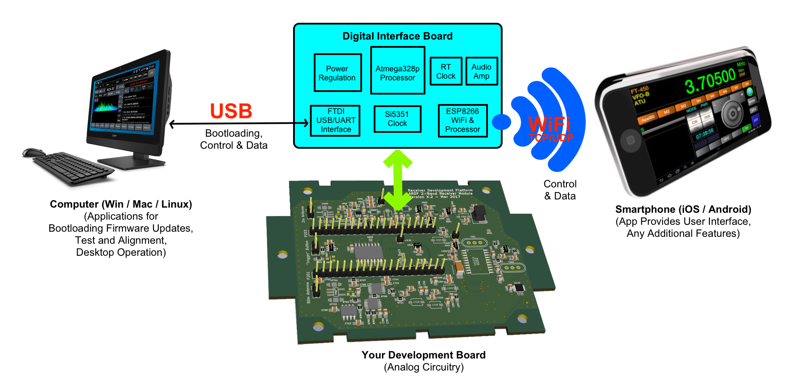

<h2>Receiver Development Platform</h2>

This project contains source code for the&nbsp;<a href="https://groups.google.com/forum/#!forum/receiver-development-platform">Receiver Development Platform</a>&nbsp;and&nbsp;<a href="http://openardf.org/index.php/ardf-open-equipment-project/">Open ARDF Equipment Project</a>. When this software is built using Atmel Studio 7 (ATmega328p) and Arduino IDE (ESP8266) it will generate object code to run on the processors utilized in that project. The following diagram illustrates the concept:

<strong>Digital Interface&nbsp;</strong>- A printed circuit board that provides a digital interface between an external device (e.g., PC, smartphone, etc.) to a development board to which it is connected.

This project is written in the C programming language, using the Atmel Studio 7 integrated development environment for ATmega328p software development, and Arduino IDE for ESP8266 software development.

Due to the limited memory resources of the ATmega328p processor, all software for that target processor was written to minimize the size of the object file. Driver files are written to contain only the functionality required for this project, so they do not necessarily support all the features of the devices for which they are written. This is an embedded project, with limited opportunities for the user to enter illegal values or perform illegal actions, so error checking is often omitted in order to improve performance and reduce object file size.

Main program entry and all interrupt service routines (ISRs) are contained in main.c. Most program control pre-compiler definitions are contained in defs.h. Certain major features are held in their own file modules, including:

<ul>
<li><strong>Linkbus</strong> (linkbus.c) - a simple serial inter-processor communication protocol</li>
<li><strong>Receiver</strong> (receiver.c) - support specific to the dual-band ARDF receiver board</li>
</ul>

Minimalist driver support is contained in files named for the supported hardware device:

<ul>
<li><a href="http://www.silabs.com/documents/public/data-sheets/Si5351-B.pdf">Si5351</a>: I2C configurable clock generator</li>
<li><a href="http://www.nxp.com/documents/data_sheet/PCF8574_PCF8574A.pdf">PCF8574</a>: General-purpose remote I/O expansion via I2C-bus</li>
<li><a href="http://www.nxp.com/documents/data_sheet/PCF2129.pdf">PCF2129</a>: Accurate RTC with integrated quartz crystal</li>
<li><a href="http://datasheets.maximintegrated.com/en/ds/DS3231-DS3231S.pdf">DS3231</a>: Extremely Accurate I2C-Integrated RTC/TCXO/Crystal</li>
<li><a href="http://www.analog.com/media/en/technical-documentation/data-sheets/AD5245.pdf">AD5245</a>: 256-Position I2C-Compatible Digital Potentiometer</li>
<li>TODO: Add <a href="http://www.ti.com/lit/ds/symlink/dac081c081.pdf">DAC081C085</a>&nbsp;support</li>
<li>TODO: Add <a href="http://datasheets.maximintegrated.com/en/ds/MAX5477-MAX5479.pdf">MAX5478EUD+</a>&nbsp;support</li>
<li>TODO: Add <a href="http://www.atmel.com/Images/Atmel-8815-SEEPROM-AT24CS01-02-Datasheet.pdf">AT24CS01-STUM</a>&nbsp;support</li>
</ul>

ATmega328p project code builds with a minimum of effort under the <a href="http://www.atmel.com/microsite/atmel-studio/">Atmel Studio 7</a> Integrated Development Environment.

ESP8266 project code builds with a minimum of effort under the <a href="https://www.arduino.cc/en/Main/Software">Arduino Integrated Development Environment</a> version 1.8.2 or later, with board support installed for the Adafruit <a href="https://www.adafruit.com/product/2471">HUZZAH ESP8266 Breakout installed.</a>.

TODO: Configuration information and import instructions for using this code under Atmel Studio 7:

All original source code is released under the "<a href="https://opensource.org/licenses/MIT">MIT License</a>"

